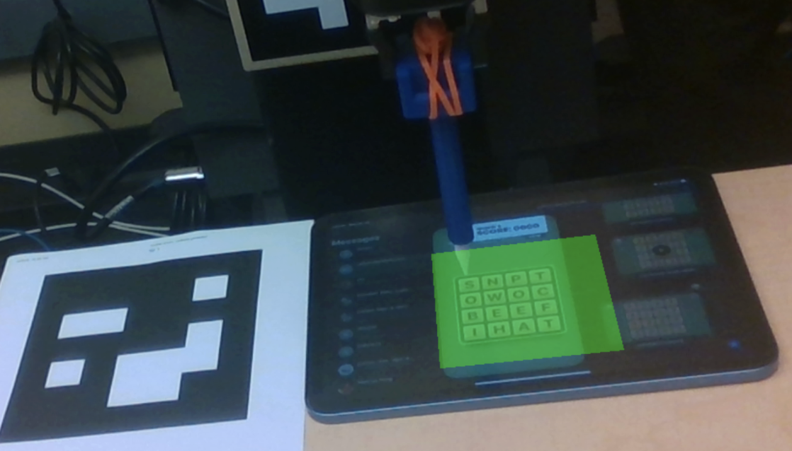
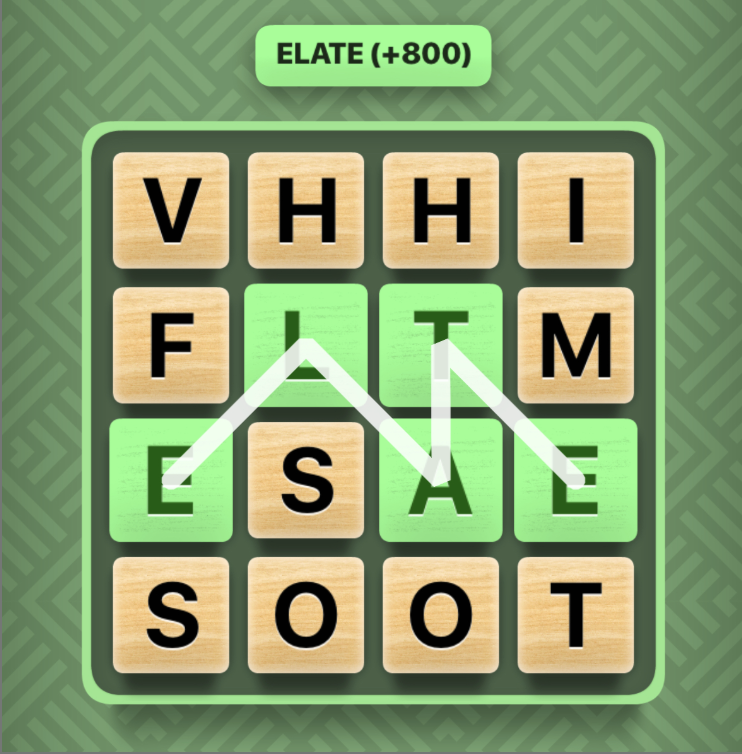
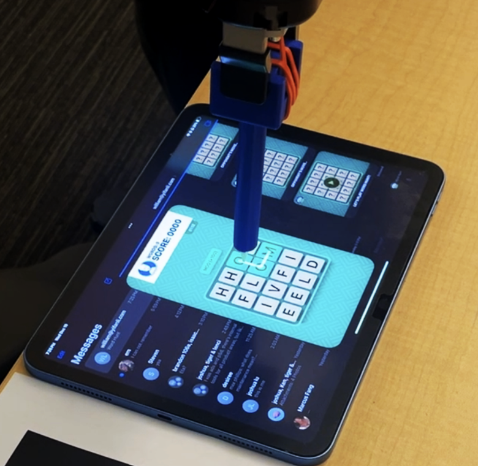

# 2. Design

## (a) What design criteria must your project meet? What is the desired functionality?
- Accurate Perception: The system must reliably detect the Word Hunt board, estimate its pose, and recognize the letters within the board.
- Correct Planning: The system must compute valid word paths under the constraints of the Word Hunt game and convert these discrete paths into physically feasible paths for the robot to trace.
- Precise Movement: The robot must trace the words accurately and precisely on a flat surface, as the slightest deviations can cause damage to the tablet or lead to incorrect selection of letters within the board.

**Desired Functionality:**  
The desired functionality of the project is for the robot to, given a Word Hunt game board positioned relative to an ArUco tag, autonomously detect and interpret the board, plan its actions, and play the Word Hunt game end to end and score as high as possible.

    <figure style="width: 30%; text-align: center;">
        <figcaption style="margin-bottom: 8px;">Sensing</figcaption>
        
        <!--  -->
    </figure>
    <figure style="width: 30%; text-align: center;">
        <figcaption style="margin-bottom: 8px;">Planning</figcaption>
        
        <!--  -->
    </figure>
    <figure style="width: 30%; text-align: center;">
        <figcaption style="margin-bottom: 8px;">Actuation</figcaption>
        <!--  -->
        
    </figure>

## (b) Describe the design you chose.

We chose to position an ArUco tag on the table in front of the UR7e and place the iPad at a known fixed offset relative to that tag. Using a RealSense camera, we simultaneously observe both the table-mounted ArUco tag and the ArUco tag located at the base of the UR7e. We use ``aruco_node`` to detect the positions and IDs of these tags, which allows us to compute the iPad’s position in the robot’s frame. The iPad position is defined as a point slightly above the screen, corresponding to the top-left square of the Word Hunt board.

This iPad reference point is published as a topic, and a processor node transforms it into the robot’s ``base_link`` frame. This transformed point is then used to move the UR7e end effector to the iPad location. Once positioned, we provide an optional command-line loop that allows for small manual adjustments to the end-effector pose. This is primarily used to account for minor localization error and to ensure the robot does not apply excessive force to the iPad with the Apple Pencil. In practice, once the iPad offset relative to the ArUco tag is calibrated, these adjustments are rarely needed.

After positioning, the Word Hunt game is opened on the iPad. The main node then subscribes to the camera image topic and, using the known offsets relative to the table ArUco tag, extracts the four corner points of the Word Hunt grid. A homography is computed to rectify the image, producing a flat, top-down view of the board. This rectified image is sent to a Qwen API inference LLM with prompting to return the 16 letters on the board.

The detected letters are converted into a 4×4 2D array and passed into our Word Hunt solver, which uses depth-first search with backtracking to find all valid word paths. Each word’s path is stored in a dictionary, and the words are sorted by length to prioritize higher-scoring words. The paths, originally represented as grid indices (e.g., (0,1)), are then converted into continuous (x, y) positions in the ``base_link`` frame. The robot iterates through these word paths, tracing them sequentially until the game timer expires, at which point the system automatically stops after 80 seconds, matching the Word Hunt game duration.

## (c) What design choices did you make when you formulated your design? What trade-offs did you have to make?

We used two ArUco tags in our design, with one located at the base of the UR7e and one placed on the table right next to the iPad with the game board. This was effective because by detecting the positions of these tags, we were able get the position of the iPad in the robot's frame, and thus precisely calculate coordinates for the game board. However, because our RealSense camera was placed in front of this entire setup, the one disadvantage of this approach was that we had to step out of frame and make sure to not accidentally the ArUco tag when the system was trying to compute the position of the iPad.

When we formulated our design, we decided to include a calibration step in which we manually adjusted the arm using small offsets so that the pencil would be positioned just above the top-left square. This step was necessary because the camera was placed slightly differently each time the system was set up, causing previously hard-coded offsets to become inaccurate. As a result, the system had to be recalibrated whenever the camera was repositioned. While effective, this approach added an extra step and increased the setup time before the game could begin.

Another design choice involved the stylus setup process. We manually held the stylus and ran a toggle grip command so that the UR7e’s gripper could grasp the pen. This worked well because the stylus needed to point downward toward the iPad, and there was no practical way for it to stand on its own before the game started. However, this method introduced some inconsistency due to human error, as the gripper would occasionally grasp the stylus at a slight angle.

## (d) How do these design choices impact robustness, durability, and efficiency?

While these design choices were efficient and allowed the game to run smoothly, the process of recalibrating arm position, adjusting offsets, and manually inserting the pen within the UR7e's gripper definitely added more time to the setup process. If we had more time, we would improve the robustness and durability of our system so that we would not need to include these manual processes while setting up the game.

    <figure style="width: 30%; text-align: center;">
        <figcaption style="margin-bottom: 8px;">Game Setup</figcaption>
        
    </figure>

