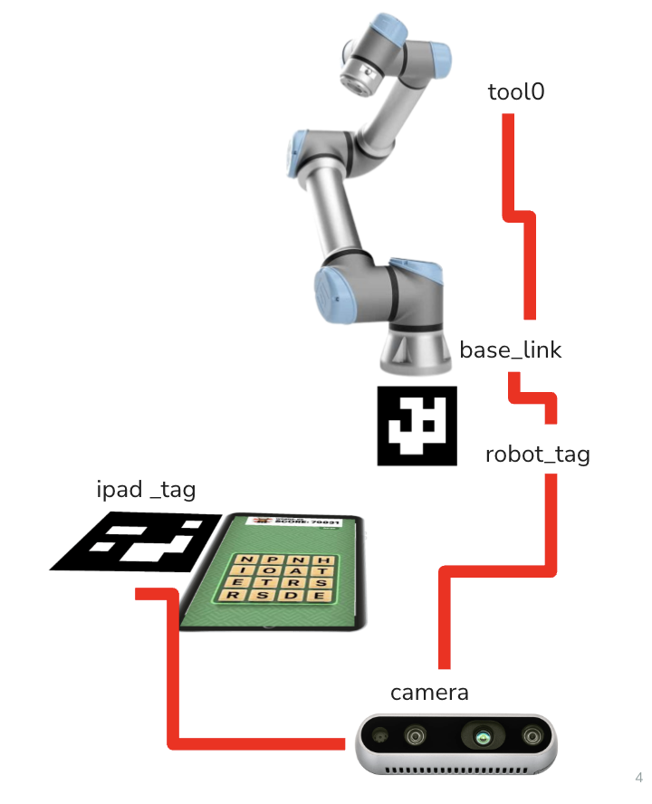
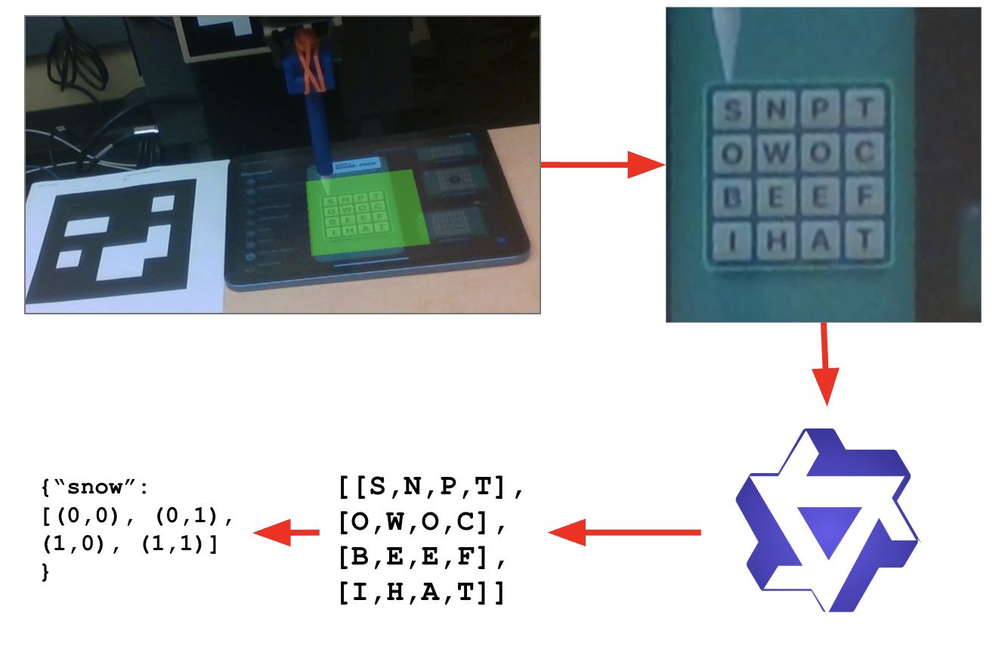
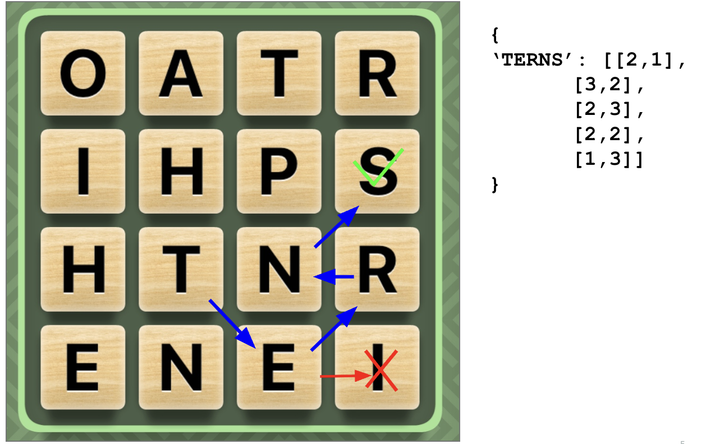

# 3. Implementation

## (a) Describe any hardware you used or built. Illustrate with pictures and diagrams.

## (b) What parts did you use to build your solution?

## (c) Describe any software you wrote in detail (launch files, URDFs, scripts). Include diagrams and flow charts.

Our software stack is built roughly on top of the Lab 7 ROS2 codebase, reusing its UR7e control interface, TF setup, and MoveIt-based motion execution. On top of this foundation, we implemented several custom ROS nodes and planning scripts to handle ArUco-based localization, coordinate transformations, vision processing, word planning, and execution control.

At a high level, the system consists of three major layers: localization and transforms, vision and planning, and robot execution.

**ArUco Localization and iPad Pose Estimation**

We implemented a custom node, `aruco_pose_node`, which subscribes to the `/aruco_markers` topic published by `aruco_node`. This topic provides detected ArUco marker IDs and their poses in the camera frame.

Two ArUco tags are used:

- **Tag A:** Mounted at the base of the UR7e
- **Tag B:** Mounted on the table near the iPad

The node filters incoming detections by marker ID and maintains a running average of each tag’s position to reduce jitter. These averaged positions are republished as PointStamped messages. Using a known, calibrated rigid transform from the table tag (Tag B) to the iPad, the node computes the iPad reference point as a 3D position slightly above the screen, corresponding to the top-left square of the Word Hunt board. This iPad point is published for downstream use as the topic `/ipad_point`.

**Coordinate Transformation to Robot Frame**

We implemented a separate node, `transform_ipad_point`, which is responsible for transforming the iPad reference point from the camera frame into the robot’s `base_link` frame using TF. This node listens for the published iPad point, performs TF lookups with retry logic to handle sensor latency, and applies the transform using tf2_geometry_msgs.

To improve stability, the transformed point is smoothed using a running average. The point is also shifted upward along the z-axis to define a safe approach height above the iPad surface. The final transformed point is published as `/ipad_point_base` and serves as the target reference for robot motion.

<figure style="text-align: center;">
    

    
    <!--  -->
    <figcaption>Figure 1: Pose estimation pipeline</figcaption>
    

</figure>

**Main Control and Execution Node**

The main execution logic is implemented in a custom node derived from the Lab 7 control framework. This node integrates perception, planning, and actuation and runs its high-level workflow in a separate thread to avoid blocking ROS callbacks.

The node subscribes to:

- `/ipad_point_base` for the iPad reference position
- `/joint_states` for the current robot configuration
- `/camera/image_raw` for vision processing

Once the required data is available, the workflow proceeds through a sequence of steps:

- **Approach motion:** The robot computes inverse kinematics to move to a position above the iPad.
- **Manual adjustment loop:** An optional command-line interface allows small positional corrections to account for localization error and ensure safe contact with the tablet.
- **Vision capture:** The robot captures an image once the board is visible and stable.

Motion planning and execution are performed using the IK planner, which generates joint trajectories and sends them to the UR7e via a FollowJointTrajectory action client.

**Vision Pipeline and Board Rectification**

We implemented a vision pipeline to extract and rectify the Word Hunt board from the camera image. Using the detected table-mounted ArUco marker, we compute a homography that maps the image region containing the board to a flat, top-down view. The board region is defined by calibrated offsets from the marker, allowing the system to reliably extract the grid despite perspective distortion.

The rectified board image is then resized and passed to an LLM-based inference pipeline for letter recognition.

**Letter Recognition via LLM Inference**

For letter recognition, we implemented a module that sends the rectified board image to a Qwen multimodal LLM through an API call. The model is prompted to return exactly 16 capital letters corresponding to the board, ordered left-to-right and top-to-bottom. The system retries inference multiple times if the returned output does not meet formatting requirements.

<figure style="text-align: center;">
    

    
    <!--  -->
    <figcaption>Figure 2: Perception Pipeline</figcaption>
    

</figure>

**Word Hunt Solver and Path Conversion**

We implemented a Word Hunt solver using depth-first search (DFS) with backtracking and a trie-based dictionary. At a high level, the solver starts from each letter on the board and explores all possible paths by recursively moving to adjacent letters (including diagonals). Depth-first search allows the algorithm to follow one potential word path as far as possible before exploring alternatives. Backtracking is used to undo steps when a path can no longer form a valid word, ensuring that each letter is only used once per word while allowing it to be reused across different paths.

To efficiently check whether a partial letter sequence could form a valid word, we use a trie, which is a tree-like data structure that stores the dictionary. Each level of the trie corresponds to the next letter in a word, allowing the solver to quickly determine whether a given prefix is valid. If a partial path does not match any prefix in the trie, the search along that path is terminated early, significantly reducing the search space.

The solver enumerates all valid words under Word Hunt adjacency constraints and stores all possible paths for each word. The resulting words are then sorted by length to prioritize higher-scoring words. Each path, initially represented as grid indices, is converted into continuous (x, y) coordinates relative to the iPad reference point in the robot’s base_link frame. These coordinates define the tracing trajectory for each word.

<figure style="text-align: center;">
    

    
    <!--  -->
    <figcaption>Figure 3: Word Hunt Solver</figcaption>
    

</figure>

**Execution Loop and Timing Control**

The robot iterates through the planned word paths, tracing each word sequentially by moving the end effector down to contact the screen, following the path, and lifting at the end of each word. The execution loop is time-limited, and the system automatically stops after approximately 80 seconds to match the duration of the Word Hunt game.

## (d) How does your complete system work? Describe each step.

Putting the whole process together, we get the following step-by-step procedure:
1. **ArUco Detection and Localization**  
    A RealSense camera observes both the table-mounted ArUco tag and the ArUco tag at the base of the UR7e. The `aruco_node` detects these tags and publishes their poses in the camera frame.

2. **iPad Reference Point Computation**  
    A custom localization node identifies the table-mounted ArUco tag and applies a calibrated offset to compute the iPad reference point, defined as a position slightly above the top-left square of the Word Hunt board. This point is published as a ROS topic.

3. **Coordinate Transformation to Robot Frame**  
    The iPad reference point is transformed into the robot’s `base_link` frame using TF. The transformed point is smoothed to reduce noise and shifted upward in the z-direction to define a safe approach position.

4. **Robot Positioning and Manual Calibration**  
    Using inverse kinematics, the UR7e moves to the approach position above the iPad. An optional command-line adjustment loop allows small corrections to compensate for localization error and ensure safe interaction with the tablet surface.

5. **Image Capture and Board Rectification**  
    Once the robot is positioned and the game is visible, the system captures an image from the camera. Using the table-mounted ArUco tag, a homography is computed to rectify the Word Hunt board into a flat, top-down view.

6. **Letter Recognition**  
    The rectified board image is passed to an LLM-based inference pipeline, which returns the 16 letters on the board in a fixed order. These letters are parsed into a 4×4 grid representation.

7. **Word Planning**  
    The Word Hunt solver uses depth-first search with backtracking and a trie-based dictionary to enumerate all valid words and their corresponding letter paths. Words are sorted by length to prioritize higher-scoring options.

8. **Path Conversion and Execution**  
    Each word path is converted from grid indices into continuous (x, y) positions in the robot’s `base_link` frame. The robot traces each word sequentially using smooth end-effector trajectories.

9. **Timed Termination**  
    The execution loop runs until the Word Hunt game timer expires, at which point the system automatically stops after approximately 80 seconds.

> Add code links and files in the `Additional Materials` page later.