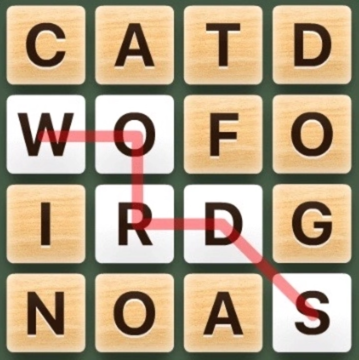

# 1. Introduction

(a) Describe the end goal of your project.

The goal of this project is to develop a system in which a UR7e robotic arm autonomously plays the game Word Hunt. Given a grid of letters displayed on a phone, tablet, or piece of paper, the robot will detect the board, recognize individual letters, compute valid word paths by connecting adjacent letters, and physically trace those words on the board using a stylus. The system integrates perception, planning, and control to complete a closed-loop task from visual input to precise physical actuation.

    

To further explain the game, the image above shows a standard Word Hunt board consisting of a 4×4 grid of letters. Players form words by tracing paths through adjacent letters, where movement is allowed horizontally, vertically, and diagonally, and each letter tile may be used at most once per word. Words are scored based on their length, with longer words earning more points. The objective of the game is to find and trace as many high-scoring words as possible within the time limit.

(b) Why is this an interesting project? What interesting problems do you need to solve to make your solution work?

This problem is interesting because it integrates over multiple core robotics domains. Within computer vision and perception, the system must robustly detect the game board and interpret the letters, as well as localize the game board properly using ArUco tags. Under planning, there is an interesting algorithmic challenge in finding the words and executing an efficient algorithm. Finally, the relatively small size of the game board necessitates maintaining both precision and accuracy throughout the whole procedure.

(c) In what real-world robotics applications could the work from your project be useful?

The techniques used in this project are applicable to a variety of real-world robotics problems involving vision-guided manipulation. Examples include robotic writing or drawing systems, automated inspection and annotation tasks, assistive robots that interact with touchscreens or physical documents. 